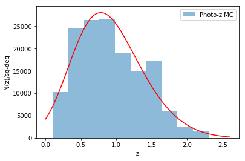
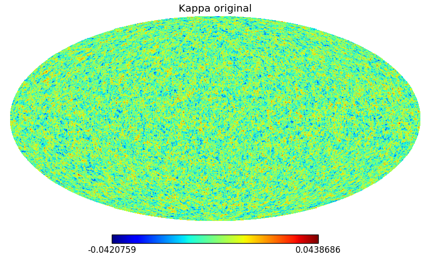
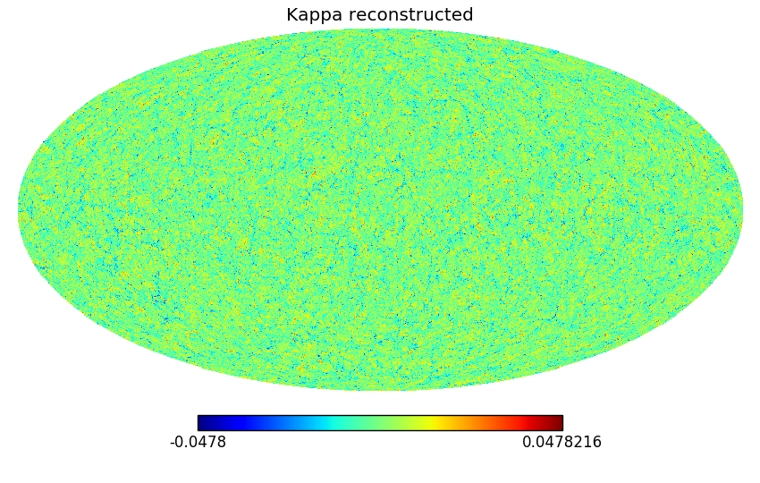
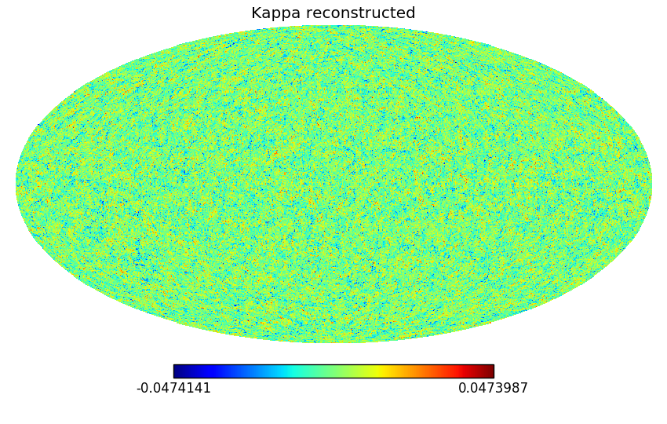

# Mass map simulation notes

## Introduction

In order to test the different mass mapping algorithms for the LSST-DESC effort
to create mass maps for HSC data, we generated one full-sky simulation which
tries to resemble the HSC-Wide survey characteristics.

This simulation has been generated using `CoLoRe`: http://github.com/damonge/CoLoRe.
The `CoLoRe` parameter file used to generate it is in this directory `param_hsc.cfg`.

The simulation is a 2LPT dark matter simulation with a linear bias poisson sampling
to generate the source catalog. It is based on a Planck LCDM cosmology. The power 
spectrum used to generated this simulation can be found at `pk_planck.txt`.
The sources are generated following the N(z) contained in `nz_hsc.txt` and with the
bias at `bz_lsst.txt`.

We used a box with 4096^3 cells from redshift $z_{min}=0.05$ to $z_{max}=2.5$. This
leads to a resolution of 1.96 Mpc/h. We generated 12 lens planes at $z=0.2, 0.4, 0.6,
0.8, 1.0, 1.2, 1.4, 1.6, 1.8, 2.0, 2.2, 2.4$. These maps are stored as healpix maps
with Nside=1024. 

## N(z)

The redshift distribution was obtained using data from HSC-deep and making the depth
cuts to match the wide field present in https://arxiv.org/pdf/1702.08449.pdf. After
this we made a 5-th degree polynomial fit to the logarithm of the number of counts.
The resulting N(z) and the fit can be seen in the figure below. The histogram was 
genearted using `photoz_mc` from the HSC database. This is take from MC samples of
the data. The total number density is 9.1 galaxies/arcmin$^2$. The resulting N(z)
is in `nz_hsc.txt`. The columns of this file are z, n(z) with n(z) in units of 1/sq-deg.

## Bias

We selected a bias inversely proportional to the growth following the expression
b(z) = 0.95/D(z). This bias is in the file `bz_lsst.txt` and was produced by `mk_curves.py`.

## Catalogs

The catalogs are `FITS` tables containing the following columns:

* `RA`: Right ascension in degrees of the source.
* `DEC`: Declination in degrees of the source.
* `Z_COSMO`: Cosmological redshift of the source.
* `DZ_RSD`: Redshift change due to redshift space distortions.
* `E1`: Noiseless $e_{1}$ ellipticity of the source.
* `E2`: Noiseless $e_{2}$ ellipticity of the source.

There are 64 files, each one corresponds roughly to 2 to 3 healpix pixels of Nside=4.
The correspondence between each file and the pixel number is:
pixels = i, i+64, i+2*64, ... while pixels<192

Where i is the index of the file (from 0 to 64).

## CPU requirements

The simulation was run using 64 Cori Haswell nodes, with 64 threads each (32 cores/node 2
threads). The total running time was 810.3 seconds.

## Validation

We performed a basic full-sky KS reconstruction of the kappa maps. In order to do so we used
two different redshift bins (from 1.58 to 1.62 and from 1.5 to 1.7) and used the KS method
to get the kappa maps. The results can be seen in the figure below. We used the script
`test_sim.py`. 

## License

*TBD*      
